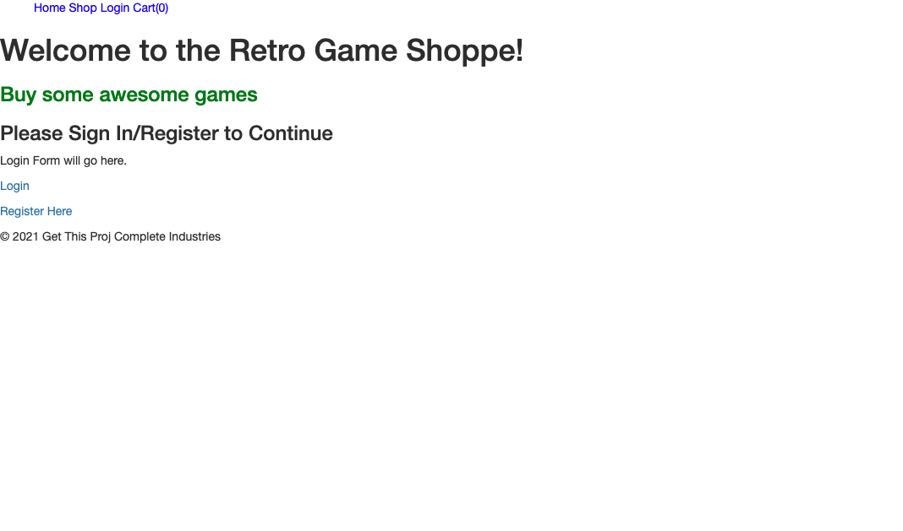
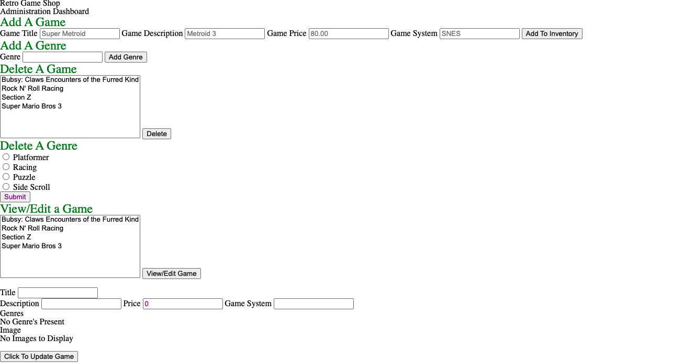
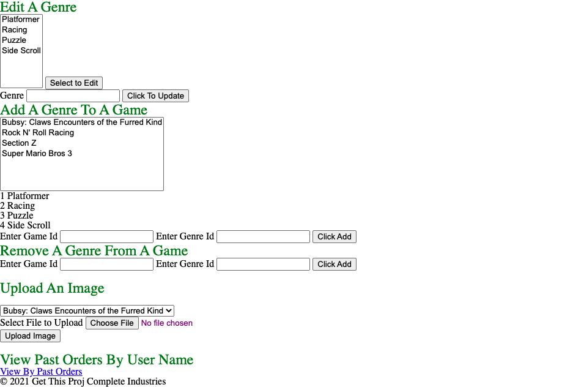
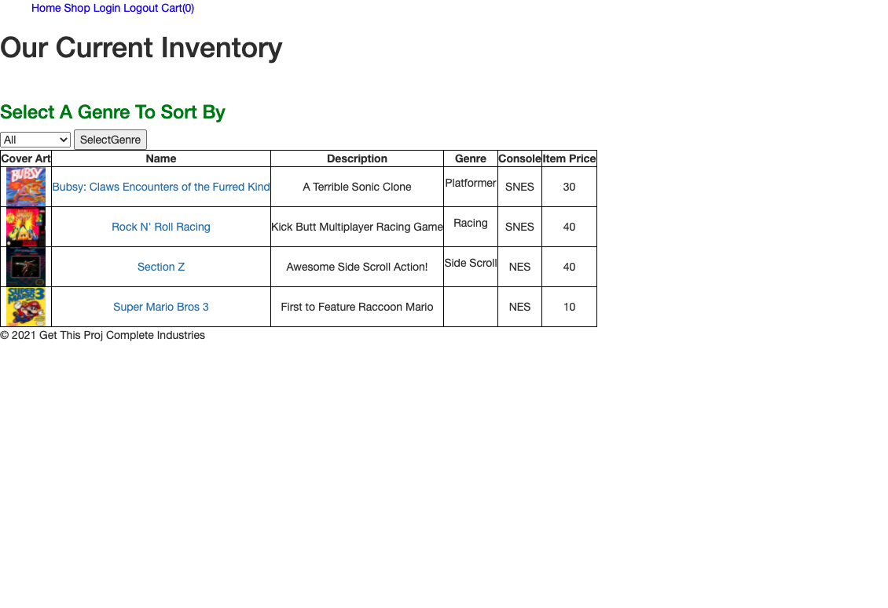
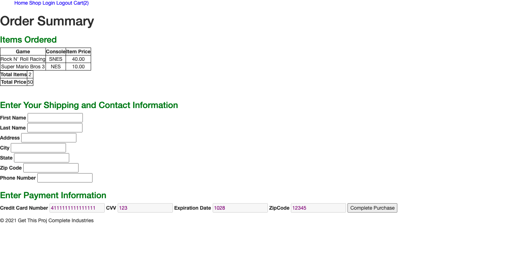
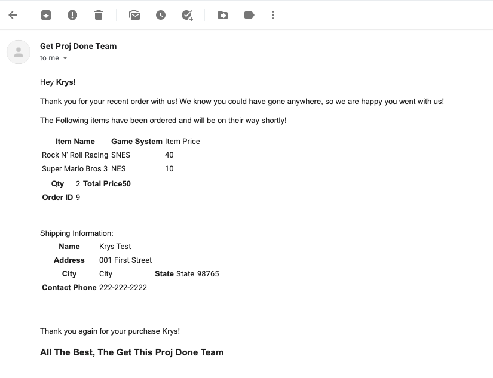

## Project ECommerce Store - Demonstration of Technologies
### Retro Video Game Store!
---
## Web Application

This is retro game store web application Client composed using:
+ Razor Pages
+ HTML
+ CSS
+ Bootstrap. 

Server was written in C# using:
+ ASP.NET Core 3.1
+ Entity Framework Core
+ MVC framework.

This is a store front that specializes in the selling of retro video games.  It is a demostration in utilization listed 
packages and frameworks.  It contains a database of example video games with full CRUD capabilities, and RESTful API calls.
It includes the ability to add Genres, and sort by them.  Data is stored in a **SQL** database.  
Features an Administrator Dashboard with restrictions implemented as either an Admin or an Editor role.  

---
Sample Login Credentials:

|User Name|Password|Email|
|--|--|
|admin|P!assword123|admin@example.com|
|editor|Ed1Tor!|editor@example.com|
|guest|S1am!Ple|guest@notvalid.com|

---

## Tools Used
Microsoft Visual Studio Community 2019 (Version 16.8.6) 

- C#
- ASP.Net Core
- Entity Framework
- MVC
- Bootstrap
- Azure
- Authorize.net *Disabled*
- SendGrid Email API *Disabled*
- Razor Pages

---

## Recent Updates

#### V 1.0 - *2/27/21*

*Initial Publish*

#### V1.1 - *6/14/21*

 + Disabled SendGrid and Authenticate.NET functionality
 + Corrected Cart Redirection button
 + Deployed Site to Azure


---

## Getting Started with local clone

```
$ git clone https://ecommProj@dev.azure.com/ecommProj/RetroGameEcomProj/_git/RetroGameEcomProj
```
Once downloaded, you can either use the dotnet CLI utilities or Visual Studio 2017 (or greater) to build the web application. The solution file is located in the AmandaFE subdirectory at the root of the repository.
```
cd YourRepo/YourProject
dotnet build
```
The dotnet tools will automatically restore any NuGet dependencies. Before running the application, the provided code-first migration will need to be applied to the SQL server of your choice configured in the /AmandaFE/AmandaFE/appsettings.json file. This requires the Microsoft.EntityFrameworkCore.Tools NuGet package and can be run from the NuGet Package Manager Console:
```
add-migration initial
Update-Database
```

---

## Usage

### Main Page



---

### Login Page


---

### Admin Dashboard




---

### Cart Page



---

### Order Summary Page



---

### Order Confirmation Email Example



---

## Data Model

### Overall Project Schema


---
## Model Properties and Requirements

### Game

| Parameter | Type | Required |
| --- | --- | --- |
| ID  | int | YES |
| Name | string | YES |
| Description| string | NO |
| ItemPrice | float | NO |
| GameSystem | string | NO |
| ImageUrl | string | NO |

### Genre

| Parameter | Type | Required |
| --- | --- | --- |
|Id|int|YES|
|GenreName|string|YES|

### GenreGame (Game and Genre Join Table)

| Parameter | Type | Required |
| --- | --- | --- |
|GameId|int|YES|
|GenreId|int|YES|

### Cart 

| Parameter | Type | Required |
| --- | --- | --- |
|Id|int|YES|
|CartActive|bool|NO|
|UserId|string|YES|
|GameId|string|NO|
|OrderId|int|YES|
|Quantity|int|NO|
|CartTotalPrice|float|NO|

### CartGame (Cart and Game Join Table)
| Parameter | Type | Required |
| --- | --- | --- |
|GameId|int|YES|
|CartId|int|YES|

### Order
| Parameter | Type | Required |
| --- | --- | --- |
|Id|int|YES|
|UserId|string|YES|
|FirstName|string|NO|
|LastName|string|NO|
|Address|string|NO|
|City|string|NO|
|State|string|NO|
|ZipCode|string|NO|
|Phone|string|NO|
|PaymentComplete|bool|NO|
|HasShipped|bool|NO|
|IsActive|bool|NO|

### User

| Parameter | Type | Required |
| --- | --- | --- |
| ID  | int | YES |
| Username | string | YES 
|FirstName|string|NO|
|LastName|string|NO|
|Password|string|YES|
|Email | string | YES |

---

## Change Log

1.0: *Initial Launch* - 27 Feb 2021

2.0: *Bug Fixes* - 3 March 2021
+ README Updated
+ Able to Remove Game From Cart
+ Registration Email Sends after signing up
+ User Registration Not Functioning
+ Verify Order Confirmation/Receipt Email are sent

---

## Authors
JP Jones

Krystian Francuz-Harris


---


